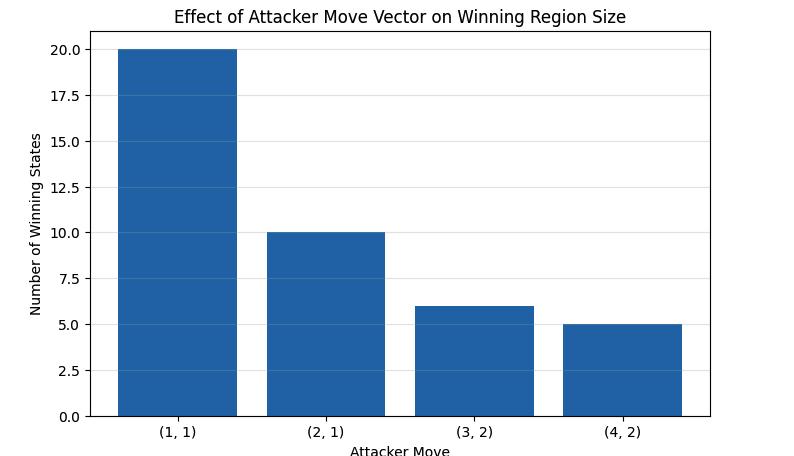

# Reachability Analysis in Attacker–Defender Robot Games

This project presents a simplified implementation of reachability analysis in attacker–defender robot games, based on my MSc dissertation:

**Reachability in Attacker–Defender Games with Different Arenas**
*MSc Advanced Computer Science, University of Liverpool (2024)*

The notebook explores how reverse reachability can be used to identify winning states in a two-player game and examines how attacker and defender actions influence the structure of the reachable state space.

## Visualisation



---

## Project Overview

The game is played on a two-dimensional integer lattice.

* The attacker attempts to reach a target state.
* The defender modifies the attacker's position through predefined moves.
* Reachability analysis is used to determine whether the attacker can still reach the target.

The implementation focuses on visualising winning regions, analysing defender intervention, and comparing different attacker strategies within bounded arenas.

---

## Experiments

### Case 1: Reachability Without Defender Intervention

* Reverse reachability analysis from the target state.
* Construction of the initial winning region.
* Visualisation of reachable states.

### Case 2: Introducing Defender Actions

* Application of defender move vectors.
* Comparison between original and modified state spaces.

### Case 3: State Classification After Defence

* Classification of states into winning and losing regions.
* Analysis of attacker recovery after defender intervention.

### Case 4: Comparing Attacker Strategies

* Evaluation of multiple attacker move vectors.
* Comparison of winning-region sizes.
* Visual analysis of reachability structures.

---

## Technologies Used

* Python
* NumPy
* Pandas
* Matplotlib
* Jupyter Notebook

---

## Key Findings

* Reverse reachability can be used to construct winning regions.
* Defender intervention can eliminate reachability for the configurations examined.
* Larger attacker move vectors generate smaller winning regions within a bounded arena.
* Different attacker strategies produce distinct reachability structures.

---

## Repository Structure

```text
.
├── README.md
└── reachability-analysis-in-attacker-defender-games.ipynb
```

---

## Author

**Soumyodipta Majumdar**

MSc Advanced Computer Science
University of Liverpool

GitHub: https://github.com/soumyodiptaM
